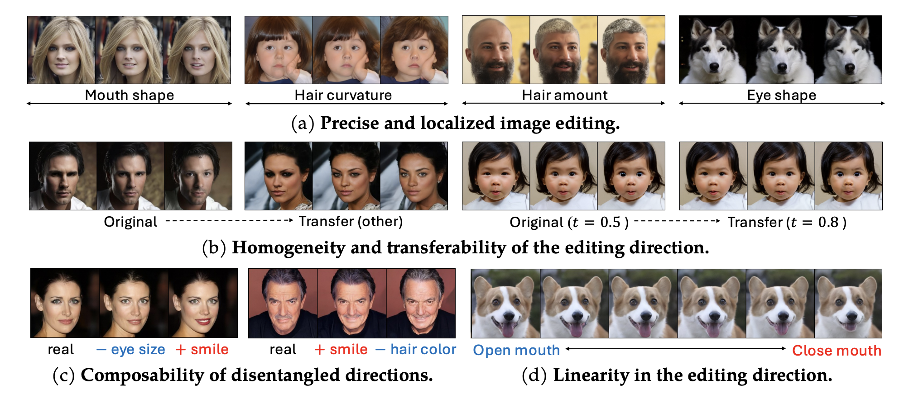
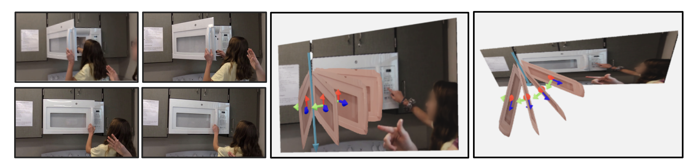

## Siyi Chen

 

Email: siyich@umich.edu

[Google Scholar](https://scholar.google.com/citations?user=j65QlFkAAAAJ&hl=en) / [Github](https://github.com/ChicyChen)

\[[Research](research.md)\]  \[[Teaching](teaching.md)\]  \[[Project](project.md)\]

## About Me

Hi, I am Siyi Chen (陈思怡). You can also call me Stella.

Currently, I am an ECE PhD student in [University of Michigan-Ann Arbor](https://cse.engin.umich.edu/) (2022 - Present), luckily advised by Professor [Qing Qu](https://qingqu.engin.umich.edu/). My research interests are generative models, representation learning, and their connections. I am interested in understanding the learning mechanism and learned information of generative or perception models for unified and interpretable utilization, and desiging better learning algorithms with inspirations from optimization, physics, and human brains. Specifically, I am studying the aforementioned questions in diffusion models, multimodal learning, self-supervised representation learning, and dynamics modeling.

Previously, I was a dual degree undergraduate student (2018 - 2022): At [University of Michigan-Ann Arbor](https://cse.engin.umich.edu/), I majored in CSE & minored in Mathematics. At [UMJI](https://www.ji.sjtu.edu.cn/), [SJTU](https://en.sjtu.edu.cn/), I majored in ECE. At UM, I was luckily advised by professor [David Fouhey](https://web.eecs.umich.edu/~fouhey/) and mentored by [Shengyi Qian](https://jasonqsy.github.io/) on computer vision.

## News

1. \[10/2024\] Two papers on diffusion models are accepted by NeurIPS 2024 M3L Workshop!
2. \[09/2024\] Our work [Exploring Low-Dimensional Subspaces in Diffusion Models for Controllable Image Editing](https://arxiv.org/abs/2409.02374) is accepted by NeurIPS2024!
3. \[09/2024\] Two papers ([paper1](https://arxiv.org/abs/2409.02374), [paper2](https://www.arxiv.org/abs/2409.02426)) on dffisuion models are released!

4. \[09/2024\] [One paper](https://arxiv.org/abs/2409.02371) on video representation learning is released!

## Preprints

### Unfolding Videos Dynamics via Taylor Expansion (2023)

***Siyi Chen***, [Minkyu Choi](https://scholar.google.co.kr/citations?user=QiKqiT4AAAAJ&hl=en), [Zesen Zhao](https://www.linkedin.com/in/zesen-zhao-b1b859244/?locale=en_US), [Kuan Han](https://www.linkedin.com/in/kuan-han-902a7a278/), [Qing Qu](https://qingqu.engin.umich.edu/), [Zhongming Liu](https://libi.engin.umich.edu/profile/zhongming-liu/)

\[[Paper](https://arxiv.org/abs/2409.02371)\]

 

## Publications

### Exploring Low-Dimensional Subspaces in Diffusion Models for Controllable Image Editing (NeurIPS 2024)

***Siyi Chen****, [Huijie Zhang*](https://www.huijiezh.com/), [Minzhe Guo](https://www.linkedin.com/in/minzhe-guo/), [Yifu Lu](https://scholar.google.com/citations?user=ybsmKpsAAAAJ&hl=en), [Peng Wang](https://peng8wang.github.io/), [Qing Qu](https://qingqu.engin.umich.edu/)

\[[Paper](https://arxiv.org/abs/2409.02374)\] \[[Website](LOCO/index.html)\] \[[Code](https://github.com/ChicyChen/LOCO-Edit)\]

 

### Diffusion Models Learn Low-Dimensional Distributions via Subspace Clustering (NeurIPS Workshop 2024)

[Peng Wang](https://peng8wang.github.io/), [Huijie Zhang](https://www.huijiezh.com/), [Zekai Zhang](https://openreview.net/profile?id=~Zekai_Zhang5), ***Siyi Chen***, [Yi Ma](https://scholar.google.com/citations?hl=en&user=XqLiBQMAAAAJ), [Qing Qu](https://qingqu.engin.umich.edu/)

\[[Paper](https://www.arxiv.org/abs/2409.02426)\] \[[Code](https://github.com/huijieZH/Diffusion-Model-Generalizability)\]

 

### Understanding 3D Object Articulation in Internet Videos (CVPR 2022)
[Shengyi Qian](https://jasonqsy.github.io/), [Linyi Jin](https://jinlinyi.github.io/), [Chris Rockwell](https://crockwell.github.io/), ***Siyi Chen***, [David Fouhey](https://web.eecs.umich.edu/~fouhey/)

\[[Paper](https://arxiv.org/abs/2203.16531)\] \[[Website](https://jasonqsy.github.io/Articulation3D/)\] \[[Code](https://github.com/JasonQSY/Articulation3D)\]

 

<!-- ## Miscellaneous

 

I took this picture in Ushuaia by chance. It's so lovely. -->

<!-- ------ -->
<!-- ## Resources -->

<!-- 1. [Research](research.md) -->

<!-- 2. [Project](project.md) -->

<!-- 3. [Teaching](teaching.md) -->

<!-- 4. [Game](game.md) -->

<!-- 5. [Miscellaneous](miscellaneous.md) -->
