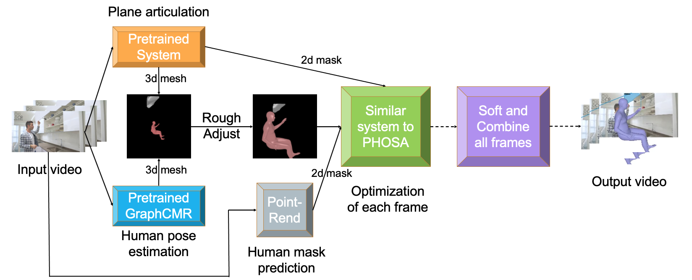
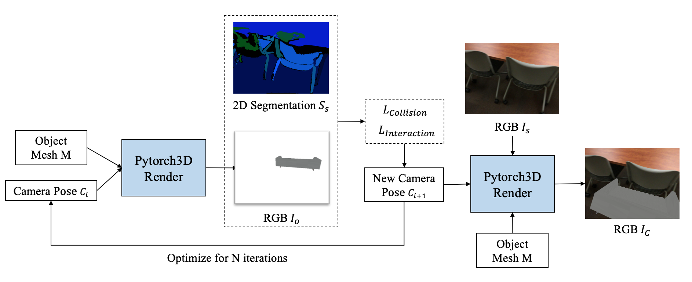

<!-- [Home](index.md) -->

# Project

## Academic Projects

### Design A Roller Coaster

*Student Group: Qi Shen, Siyi Chen, Yigao Fang*

The University Physics Competition: Gold Medal Winnner

[Report](Others/190B.pdf)

 

### Convex Presentations of Translation Surfaces

*Student Group: Andrew Keisling, Brendan Nell, Kaiwen Lu, Siyi Chen*

*Advisors: [Chaya Norton](https://lsa.umich.edu/math/people/postdoc-faculty/nchaya.html), [Paul Apisa](http://www-personal.umich.edu/~apisa/)*

*Mentors: Christopher Zhang, Sayantan Khan*

 

1. We (a group of students really green to topology) have designed and implemented beta versions of enumerating origamis in H(2).
2. We have utilized SageMath to implement the convexity test presented in [this paper](https://arxiv.org/abs/1306.3606) by Lelievre and Weiss.

[Abstract](Origami/intro.pdf) 
[GitLab](https://gitlab.eecs.umich.edu/logm/wi21/convex-presentations-of-translation-surfaces)  [Report](Origami/report.pdf) 
[Poster](Origami/poster.pdf)

### Combined Understanding of 3D Plane Articulation and Partial Human Pose Estimation

*Advisor: [David Fouhey](https://web.eecs.umich.edu/~fouhey/)*

*Mentor: [Shengyi Qian](https://jasonqsy.github.io/)*

 

1. Independently predict 3D partial human poses as SMPL meshes  in pytorch3d following Rockwell’s methods. And use PointRend to obtain 2D human masks.

2. Independently predict  2D plane masks as well as 3D articulation information. 

3. Use a differential render in pytorch3d similar to the NMR in PHOSA for back-propagation,  to build a similar system optimizing the position and size of the person considering 3d space relationship and interaction for each single image. 

[GitHub](https://github.com/ChicyChen/CombinedOPT)
[Poster](SURE/poster.pdf)

### Generate 3D Indoor Synthetic Dataset

*Advisor: [David Fouhey](https://web.eecs.umich.edu/~fouhey/)*

*Mentor: [Shengyi Qian](https://jasonqsy.github.io/)*

[GitHub](https://github.com/ChicyChen/AM3S)

 

<!-- ### Simple Virtual Camera in Python
*Advisor: [Peisen Huang](https://www.ji.sjtu.edu.cn/about/faculty-staff/faculty-directory/faculty-detail/92/)*

An implementation of simple pinhole camera & lens camera with/without distortion.

[GitHub](https://github.com/ChicyChen/VirtualCameras) -->

## Game Designs

### Asylum 7

*Cosmix Hex Studio: Siyi Chen, Dawei Wang, Zhongqian Duan, Yigao Fang, Ruipu Li*

EECS 494 Game Design Project 3

[Download Mac/Windows](https://drive.google.com/drive/folders/19tqpVue4BAntjGUJz0MaRSeANvv_MPdh?usp=sharing)

### Save My Love

*Student Group: Siyi Chen*

EECS 494 Game Design Project 2

[play online](http://www-personal.umich.edu/~siyich/Web_Save_My_Love/)

### Zelda(1986) Rebuilt

*Student Group: Siyi Chen, Yigao Fang*

EECS 494 Game Design Project 1

[play online](http://www-personal.umich.edu/~siyich/Web_Zelda/)

### Monocular Depth Estimation Based on Convolutional Neural Networks

*Student Group: Dawei Wang, Ruiyi Wang, Yiyang Qiu, Siyi Chen*

EECS442 Computer Vision: Final Project

[GitHub](https://github.com/Wangdawei00/EECS442-project)
[Slides](EECS442/slides.pdf)
[Report](EECS442/report.pdf)

<!-- ## Research Projects -->

